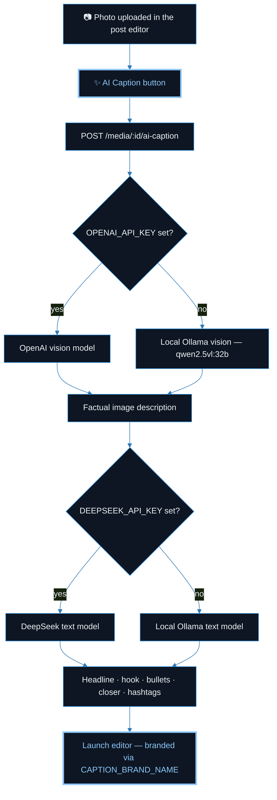
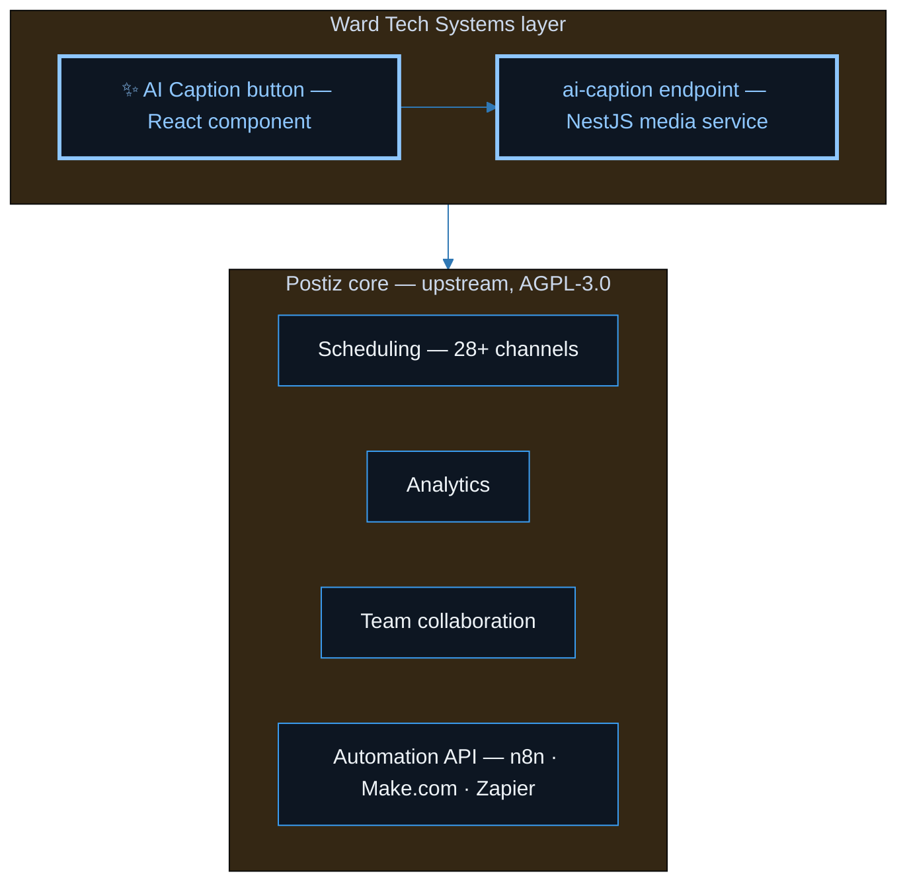

🛰️

<b>W A R D&nbsp;&nbsp;T E C H&nbsp;&nbsp;S Y S T E M S</b>

<samp>— SOCIAL PUBLISHING ENGINE —</samp>

# Schedule Everything. Caption It With AI.

**Ward Tech Systems' internally built AI Caption workflow, running on top of an AGPL-3.0 open-source scheduling core — self-hosted, 28+ channels, no vendor lock-in.**

**[AI Caption](#ai-caption)** · **[Configuration](#config)** · **[Quick Start](#start)** · **[Built on Postiz](#upstream)** · **[Compliance](#compliance)** · **[FAQ](#faq)**

 

<a href="https://wardtechsystems.com"><b>wardtechsystems.com</b></a>

---

## ⚡ At a Glance

| Question | Answer |
| :--- | :--- |
| **What is this?** | Ward Tech Systems' internal social publishing engine — a fork of [Postiz](https://github.com/gitroomhq/postiz-app) with an AI captioning layer built on top. |
| **What did Ward Tech Systems add?** | A one-click **✨ AI Caption** button in the post editor: uploaded photo → factual vision description → structured caption (headline, hook, bullets, closer, hashtags) → straight into the launch editor. |
| **What's inherited from upstream?** | The entire scheduling core: 28+ channels, analytics, team collaboration, and the automation API (n8n / Make.com / Zapier) — all from the open-source Postiz project. |
| **How do I run it?** | Follow the upstream [Quick Start Guide](https://docs.postiz.com/quickstart). AI Caption works with **zero API keys** out of the box via local Ollama defaults. |
| **License** | AGPL-3.0, inherited from the upstream Postiz project. |

<b>📑 Table of Contents</b>

 

- [At a Glance](#glance)
- [Overview](#overview)
- [AI Caption — the Ward Tech Systems addition](#ai-caption)
  - [How it works](#ai-caption)
  - [See → Write → Post](#steps)
  - [Configuration](#config)
  - [Where the code lives](#code)
- [Quick Start](#start)
- [Built on Postiz](#upstream)
- [Tech Stack](#stack)
- [Compliance](#compliance)
- [FAQ](#faq)
- [License](#license)

## 🔎 Overview

This fork exists for one job: **internal social publishing at Ward Tech Systems** — schedule posts across every channel, measure them with analytics, collaborate as a team, and drive it all over an API. The scheduling machinery is the open-source [Postiz](https://github.com/gitroomhq/postiz-app) core, unchanged. What's new is the layer on top: an AI captioning workflow that turns any uploaded photo into a ready-to-post caption, with no copywriting required.

- **📅 Schedule** all your social media posts across 28+ channels.
- **📊 Measure** your work with built-in analytics.
- **🤝 Collaborate** — team members comment, exchange, and schedule posts together.
- **🔁 Automate** via the API with platforms like n8n, Make.com, Zapier, and more.
- **✨ Caption with AI** — the Ward Tech Systems addition, detailed below.

## ✨ AI Caption — The Ward Tech Systems Addition

> [!NOTE]
> **What Ward Tech Systems added:** a one-click **AI Caption** button in the post editor that turns any uploaded photo into a ready-to-post caption — no copywriting required. The addition is deliberately small-footprint: **one endpoint, one component** on top of the upstream core.

The full path from photo to post, including the provider fallback logic:

### 👁️ See → ✍️ Write → 🚀 Post

| Step | What happens |
| :--- | :--- |
| **1 · See** | A vision model (OpenAI, or local Ollama) looks at the uploaded photo and writes a **factual description** — grounding before copywriting. |
| **2 · Write** | A text model (DeepSeek, or local Ollama) turns that description into a structured caption: **headline, hook, bullets, closer, hashtags**. |
| **3 · Post** | The caption drops straight into the launch editor, branded via `CAPTION_BRAND_NAME` — ready to schedule like any other post. |

The two-stage split is the point: describing what's *actually in the photo* first, then writing copy from that description, keeps captions grounded instead of hallucinated.

### ⚙️ Configuration

> [!TIP]
> Every variable is **optional**. With nothing configured, AI Caption falls back to **local Ollama with sensible defaults** — zero API keys, zero external calls.

| Env var | Purpose | Default |
| :--- | :--- | :--- |
| `OLLAMA_URL` | Local Ollama endpoint | `http://localhost:11434` |
| `OLLAMA_VISION_MODEL` | Vision model for image description | `qwen2.5vl:32b` |
| `OLLAMA_TEXT_MODEL` | Text model for caption generation | same as vision model |
| `OPENAI_API_KEY` / `OPENAI_VISION_MODEL` | Use OpenAI instead of local Ollama for vision | — |
| `DEEPSEEK_API_KEY` | Use DeepSeek instead of local Ollama for caption text | — |
| `CAPTION_BRAND_NAME` | Brand name inserted into the caption | `Ward Tech Systems` |
| `CAPTION_BRAND_TAGLINE` | Tagline appended to the caption | `AI-Powered Social Captions` |

### 🗺️ Where the Code Lives

| Touchpoint | Path |
| :--- | :--- |
| **Backend endpoint** — `POST /media/:id/ai-caption` | `libraries/nestjs-libraries/src/database/prisma/media/media.service.ts` |
| **Frontend button** — ✨ AI Caption in the post editor | `apps/frontend/src/components/new-launch/ai.caption.button.tsx` |

<a href="#top">⬆ back to top</a>

## 🚀 Quick Start

1. **Stand up the core** — follow the upstream [Quick Start Guide](https://docs.postiz.com/quickstart) to get the project up and running.
2. **(Optional) choose your AI providers** — set `OPENAI_API_KEY` / `DEEPSEEK_API_KEY` for hosted models, or set nothing and let it fall back to local Ollama.
3. **Caption something** — upload a photo in the post editor and hit **✨ AI Caption**. The result lands in the launch editor, branded and ready to schedule.

## 🧩 Built on Postiz

The scheduling core underneath this fork is the open-source **[Postiz](https://github.com/gitroomhq/postiz-app)** project (AGPL-3.0) — full credit to its maintainers. Everything below the AI Caption layer is theirs:

- **Upstream repository:** [github.com/gitroomhq/postiz-app](https://github.com/gitroomhq/postiz-app)
- **Upstream docs & self-host guide:** [docs.postiz.com](https://docs.postiz.com) · [Quick Start](https://docs.postiz.com/quickstart)

## 🧰 Tech Stack

Inherited from the upstream core:

| Layer | Choice |
| :--- | :--- |
| **Monorepo** | pnpm workspaces |
| **Frontend** | Next.js (React) |
| **Backend** | NestJS |
| **Database** | Prisma ORM (defaults to PostgreSQL) |
| **Workflows** | Temporal |
| **Email** | Resend (email notifications) |

## 🛡️ Compliance

- Self-hosted social media scheduling tool supporting platforms like X (formerly Twitter), Bluesky, Mastodon, Discord, and others.
- Uses official, platform-approved OAuth flows.
- Does not automate or scrape content from social media platforms.
- Does not collect, store, or proxy API keys or access tokens from users.
- Users always authenticate directly with the social platform, ensuring platform compliance and data privacy.

## ❓ FAQ

<b>Do I need any API keys to use AI Caption?</b>

 

No. With nothing configured, both stages fall back to local Ollama (`http://localhost:11434`, `qwen2.5vl:32b` by default). API keys only come into play if you *want* OpenAI for vision or DeepSeek for text.

<b>Can I mix providers — say, OpenAI vision with local text?</b>

 

Yes. The two stages resolve independently: `OPENAI_API_KEY` switches the vision stage, `DEEPSEEK_API_KEY` switches the text stage, and each stage falls back to Ollama on its own if its key is absent.

<b>How do I put my own brand in the captions?</b>

 

Set `CAPTION_BRAND_NAME` and `CAPTION_BRAND_TAGLINE`. They default to `Ward Tech Systems` / `AI-Powered Social Captions`.

<b>Is this the official Postiz?</b>

 

No — it's a Ward Tech Systems fork built for internal social publishing. The scheduling core is unchanged upstream Postiz; for core features, self-hosting, and platform setup, the [upstream docs](https://docs.postiz.com) are the source of truth.

<b>How big is the fork's footprint?</b>

 

Deliberately tiny: one backend endpoint (`POST /media/:id/ai-caption` in the media service) and one frontend component (the ✨ AI Caption button). Small surface area keeps the fork easy to rebase on upstream.

## 📄 License

This repository's source code is available under the [AGPL-3.0 license](LICENSE), inherited from the upstream [Postiz](https://github.com/gitroomhq/postiz-app) project.

---

<b>Ward Tech Systems</b> · <a href="https://wardtechsystems.com">wardtechsystems.com</a> · <a href="https://github.com/builtbyai">github.com/builtbyai</a>

